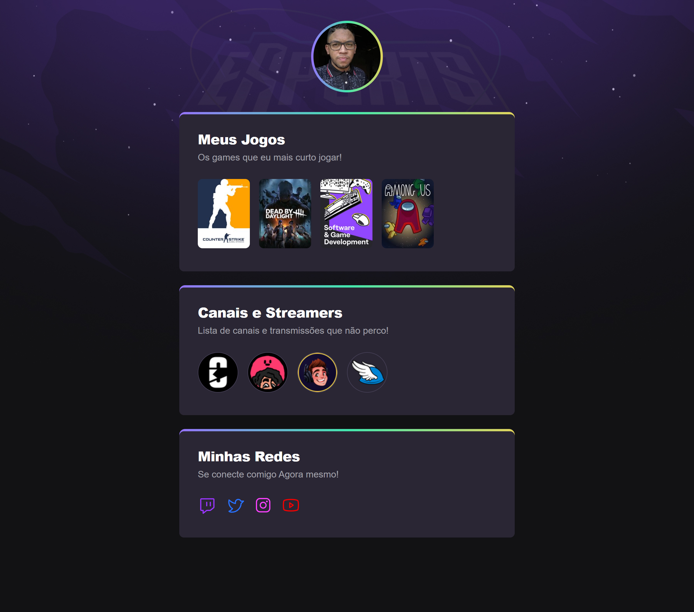
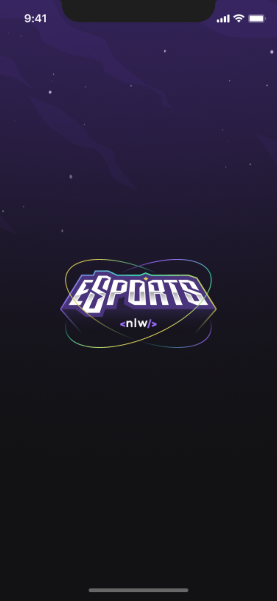
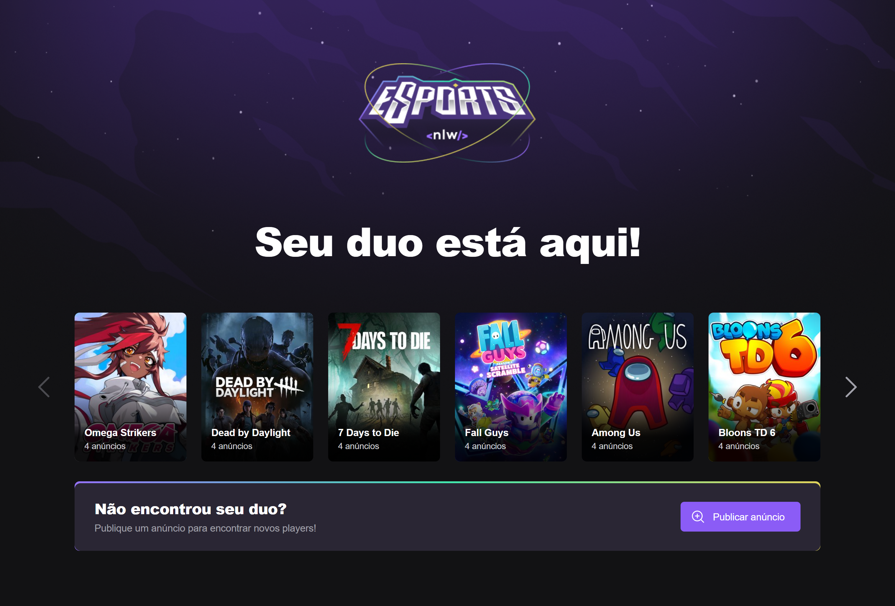

# NLW-eSports

Projeto construido do Evento NExt Level Week da Rocketseat

Maratona de Ensino de Desenvolvimento Web pela Rocketseat chamada de NLW eSports

> Trilha Explorer

[Clique aqui para acessar](https://Jefferson-HSL.github.io/NLW-eSports/trilha-Explorer/)

>Trilha Ignite - Mobile

[Clique aqui para acessar](https://Jefferson-HSL.github.io/NLW-eSports/trilha-ignite/mobile/pages/splash/)

>Trilha Ignite - Website

[Clique aqui para acessar](https://Jefferson-HSL.github.io/NLW-eSports/trilha-ignite/website/)

## Tecnologias

- HTML 5
- CSS 3
- Git e GitHub